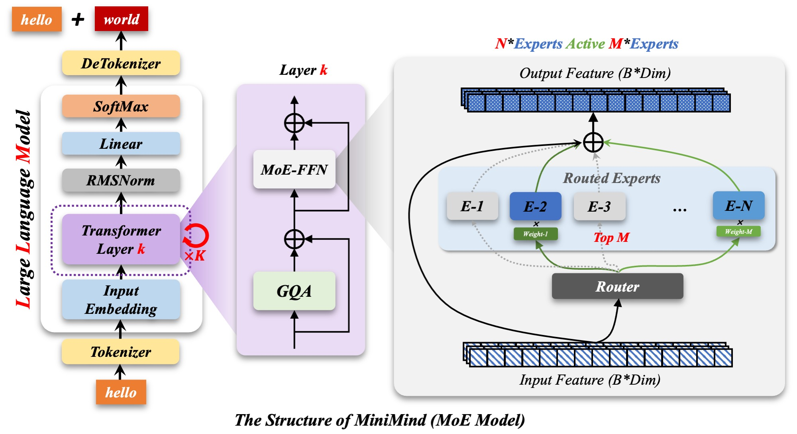

# 概述

## 感悟

只要每一步都朝着目标方向走，肯定最快到达。对吗？

当然不是。Dijkstra 算法提出，在寻找最短路径时，必须暂时放弃直奔终点，反而要探索那些看起来绕远路的节点。算法从开始节点出发，找到距离当前节点最短、且尚未被确定下来的节点，然后用它去更新所有邻居节点的潜在距离。一旦某个节点被确定为最短路径节点，这个距离就不会再被修改。整个搜索过程像一个不断扩大的涟漪，直到某一次波浪拍打到预设的终点。

我想说的是，最短路径一定是直线，最快路径不一定是直线。

Dijkstra 算法告诉我，最快的路径往往藏在那些看起来绕远的路径上。我愿意先走弯路，是因为真正的抵达从来不是靠对准方向，而是靠看清所有的代价，试所有的错。有些人直奔终点，却被困在半途；有些人独自走了很远，反而第一个敲开了门。

所以，兄弟，别怕绕路。怕的是只顾看着方向，却忘记了体验每个节点给你的代价。经验，在试错的基础上不断发展、进步。

一开始跟着MiKio视频，难绷，打算看源码问ai，结果豆包没水平，就想着整个gpt，倒腾了一下午，才在朋友的帮助下搞上了GPT plus。现在学习轻松多了。，

## 什么是复现？

什么是复现？我起初以为是下载别人的代码、配置环境、运行代码。其实不是，复现应该是：还原作者的逻辑思路！

2026 年，我是 27 届应届生。为了找一份实习，我海投简历。有个 HR 在 BOSS 上问了我几个问题，其中一个就是：是否复现过 GitHub 项目与论文算法，有无个人代码仓库、是否熟练使用 Git 命令？

于是我开始试着复现 MiniMind。如开头所说，我太天真了，事实没那么简单。好在 B 站找到了 UP 主，可以跟着学。UP 主声称“三小时三元，复现 MiniMind”，确实可以在三小时内复现，但前提是你得具备机器学习、深度学习的扎实基本功。我又天真了。这个复现至少要几周时间，像我这样 0.1 基础的人，只能跟着 UP 主学，不能自己写代码。

有句话很好：先装模做样，然后像模像样，最后有模有样。所以先简单跟着来一遍，再自己写代码。两次不行就三次，三次不行就再多来几次。

## MiniMind 复现流程

### 1. 复现四大块代码

### 2. 本质

按着下面流程图，逐个写代码块。

  

  

0.1 基础的朋友，可以看一下：

- [MiniMind 复现视频（一）](https://www.bilibili.com/video/BV1TZ421j7Ke?vd_source=17a936cc4bdf336ce68bd6a091daa956)
- [MiniMind 复现视频（二）](https://www.bilibili.com/video/BV13z421U7cs?vd_source=17a936cc4bdf336ce68bd6a091daa956)

## 3. 基础知识

### 什么是 GPT？

GPT（Generative Pre-trained Transformer）是 Google 推出的一种基于 Transformer 的语言模型。GPT 的核心是 Transformer（模型），它是一种 Attention 机制的模型。

| 术语 | 说明 |
| --- | --- |
| Token | 单词切片，对应一组向量（试图表达片段含义）。类聚是空间中的方向，可以承载语义。 |
| Tensor | 高维数组。 |
| Weight | 权重。 |
| Embedding matrix | 嵌入矩阵。 |
| QKV 三元组 | Q：query matrix；V：value matrix；K：key matrix。 |
| Softmax | 激活函数。 |
